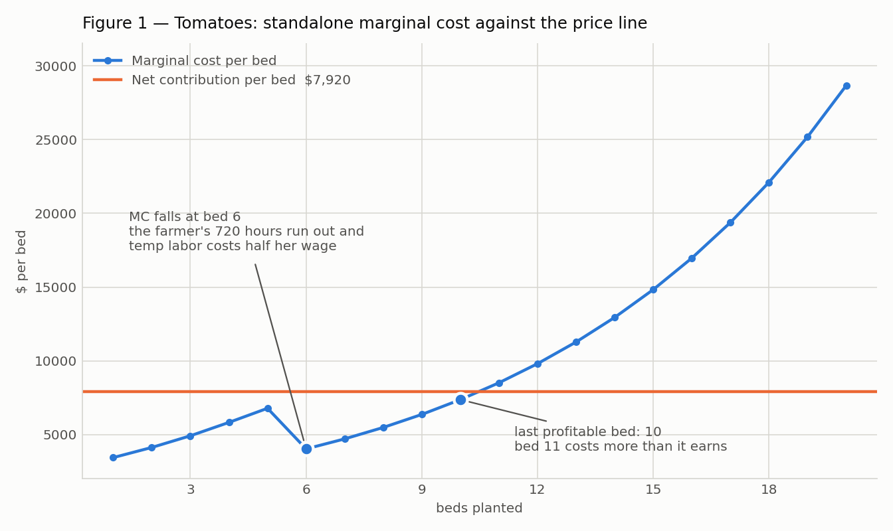
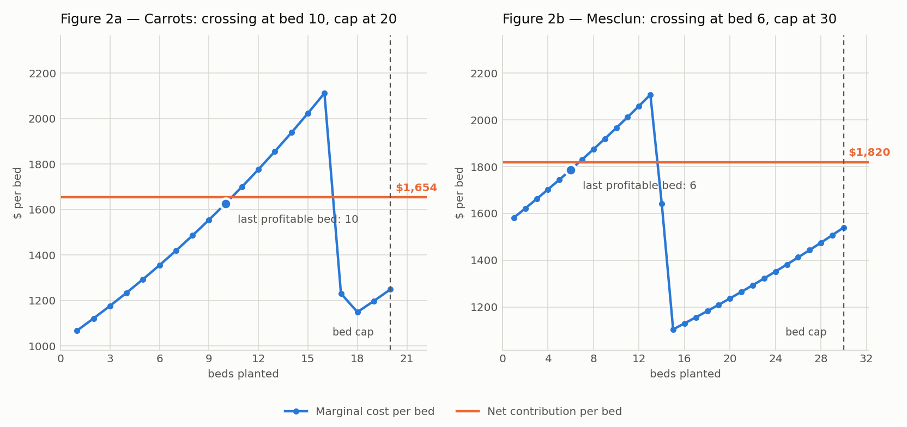

# Perfect Competition Analysis (Stage 3)

## Decision from optimizer

The profit-maximizing allocation is **10 tomato / 20 carrot / 30 mesclun** with profit **$42,761.66**, against the course's published reference of $42,762. Sixty of 64 beds planted, 5,277.22 labor hours, 720 farmer hours and 4,557.22 temp hours, which is 3.16 of the 4 workers allowed. Source: `capabilities/marginal-analysis/model.xlsx`, Summary sheet, verified against `analysis/integer_search.py`.

## 1) Why tomatoes stop at ~10 beds

Tomatoes pay the most per bed, and they also climb the fastest: each extra tomato bed makes every tomato bed 10% hungrier for labor, four times the rise on carrots and eight times the rise on mesclun. They still sell for $8,800 a bed, and cost climbs with walking, pests, and harvest crush, so bed 10 nets $551 and bed 11 costs $9,391 and loses $591. The $8,800 crop runs into its own wall at bed 10 while 20 are still allowed. **Figure 1** shows the crossing: the marginal-cost line passes above the $7,920 net-contribution line between bed 10 and bed 11.

Evidence: `MC_Tomatoes` sheet, column J at rows 15 and 16, against the price line in column M.

## 2) Which constraints bind and what relaxing one is worth

Carrots and mesclun stop the other way. She hit their bed caps and would still make $352 on one more carrot bed and $246 on one more mesclun bed. Those two caps are the only limits she is actually pressed against.

Three limits are slack, and the tomato cap is the surprise: she plants 60 of 64 beds, buys 4,557 temp hours which is 3.16 of the 4 workers allowed, and grows 10 of the 20 tomatoes she could. Paying to raise any of those three buys nothing, because she already stopped short of all of them.

**Figure 2** puts both caps beside their crossings. Carrots cross at bed 10 and the cap sits at 20, mesclun crosses at bed 6 and the cap sits at 30, so in each panel the dashed cap line stands well to the right of the point where the crop stops paying on its own. Grown alone neither would reach its cap. In the mix they both run into it.

**Expansion priority: carrots first at $352 a bed, mesclun second at $246.**

Evidence: `Allocation` sheet, constraint block rows 41 to 46.

## 3) Why tomato MC dips around ~6 beds

Hours and cost are not the same number.

Her field time is the expensive hour. The salary is $50,000 over 1,440 paid hours, so each hour she spends in the field carries $34.72. A temp costs $25,000 for the same 1,440 hours, or $17.36, half as much.

Beds 1 through 5 burn her hours. By the middle of bed 5 the 720 are gone. Bed 5 costs $7,661 because 192.92 of its 197.65 hours are hers. Bed 6 costs $4,906 because all 231.91 of its hours are hired. The scarce hour was hers. Once it ran out, the hours got cheaper even as they got more numerous.

You pay for the scarce hour, not for every minute on the clock. Bed 6 used more minutes. It used fewer expensive ones.

After bed 6 there is no cheaper labor left to switch to, so the 10% escalation runs on its own and marginal cost climbs back through the $8,800 price line at bed 11. The notch at bed 6 in **Figure 1** is that switch. Both panels of **Figure 2** show the same notch further right, at bed 17 for carrots and bed 14 for mesclun, because those crops use the farmer's hours more slowly and take longer to exhaust them.

## 4) Why plant crops that lose money standalone

That $16,489 is what carrots look like when they have to carry the whole farm.

A carrots-only season puts her $34.72 hours, her salary, and every rising-cost bed on one crop. She is not running that farm. Tomatoes already burn the expensive 720 hours and take the beds that hurt first. Carrots in the mix get what is left: cheaper temp hours and a 2.5% climb instead of the tomato 10%.

She owes $20,000 in fixed costs whether she plants a single bed or none at all, so that number cannot decide anything. What decides is whether a bed brings in more than it costs to grow. Carrots sell for $2,094 against an average variable cost of $1,918, so each carrot bed hands her $176 toward the fixed pile. Mesclun sells for $2,700 against $2,431, or $269 a bed. Across the plan she actually runs, that is $3,511 from carrots and $8,078 from mesclun. Shut either one down and she still owes the full $20,000 with that much less help paying it.

The number she needs is the change in farm profit if she plants the carrot beds or leaves them empty. That is why the model still says one more carrot bed is worth $352. A standalone loss cannot talk back to a crop she would only grow next to something else.

## Stage 1 hypothesis vs model outcome

Predicted 12 tomato / 20 mesclun / 20 carrot, 52 beds. The model found 10 tomato / 30 mesclun / 20 carrot, 60 beds.

The mesclun miss cost more.

I left ten beds unplanted that still pay. Beds 21 through 30 are worth $4,210 together: bed 21 hands her $555, bed 25 hands her $438, bed 30 hands her $280. The $246 is what the thirty-first bed would be worth. A shadow price prices the next bed, and one bed only. It cannot be multiplied.

The tomato miss is two beds that already lose money: $591 on bed 11 and $1,888 on bed 12, or $2,479. Forgone profit on ten good mesclun beds is bigger than the loss on two extra tomatoes. Together the two misses cost $6,688, which is what 12/20/20 gives up against the optimum.

They are not the same kind of mistake. The mesclun cap at 20 was a wall I drew in the wrong place. The crop still earned, I just would not let her plant it. Tomatoes at 12 was a stopping rule I ignored. Bed 11 had already crossed from profit into loss, and I planted it anyway.

One was a bad constraint. One was a bad margin. The labor check I trusted was the part that held: 4,557 of 5,760 temp hours, pool unexhausted, cost bound first.

## Figures

**Figure 1 — Tomatoes: marginal cost against the price line.** The dip at bed 6 and the crossing at bed 10, in one picture. Referenced in sections 1 and 3.

**Figure 2 — Carrots and mesclun: crossings against their bed caps.** Each panel carries its own net-contribution line, its crossing, and its cap. Referenced in sections 2 and 3.

Both figures are plotted from the `Labor & Cost` sheet of `capabilities/marginal-analysis/model.xlsx`, columns `q beds`, `Standalone marginal cost`, and `Net contribution/bed`.
